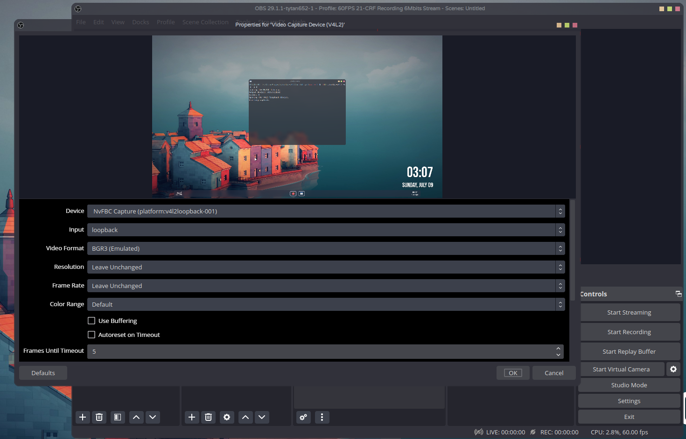

# nvfbc-v4l2

----

### Miss [obs-nvfbc](https://gitlab.com/fzwoch/obs-nvfbc)? Need a replacement? This project is for you!

This project is a tool (hack) for **Linux** that uses the [Nvidia NvFBC API](https://developer.nvidia.com/capture-sdk) 
and passes the captured frames to a [v4l2loopback](https://github.com/umlaeute/v4l2loopback) device. 

_**Because why not? It's better than nothing!**_

## Requirements:

* **An Nvidia GPU that supports NvFBC.** _(if it wasn't obvious)_
* **A Linux Desktop with CMake and GCC installed.**
* **Proprietary Nvidia Drivers.** _(maybe. I haven't tested it with the open-source drivers yet)_
* **X.org as a display server.**

----

## Installation


In short: CMake

**_But how?_**

Like this:
```shell
$ git clone https://github.com/t1stm/nvfbc-v4l2.git
$ cd nvfbc-v4l2
$ mkdir build && cd build
$ cmake ..
$ make -j${nproc}
```

----

## Running


**If you have worked with v4l2loopback before:** 

```shell
$ ./nvfbc-v4l2 -h
```

### If you haven't:

1. **Create a v4l2loopback device.**

**IMPORTANT: replace x and y with actual numbers and remember them**.

```shell
$ sudo modprobe v4l2loopback devices=1 video_nr=x card_label="NvFBC Capture" exclusive_caps=1
```

...or if you want to use the OBS Virtual Camera:

_If you don't have any other capture devices **set x to 0, and if you do, set it to the highest device number + 1**_
```shell
$ sudo modprobe v4l2loopback devices=2 video_nr=x,y card_label="OBS Virtual Camera, NvFBC Capture" exclusive_caps=1,1
```

2. **Optional:** List all available displays.

```shell
$ ./nvfbc-v4l2 -l
```

3. **Use the virtual v4l2loopback device and optionally the selected screen.**
```shell
$ ./nvfbc-v4l2 -o [v4l2-nr] -s [screen]
```

4. **Profit**



If the capture appears corrupted, try removing the v4l2loopback module and
adding it again with the commands above. If that doesn't help, open up an issue,
and I'll try my best to help. **Remember to close the program while doing this.**
