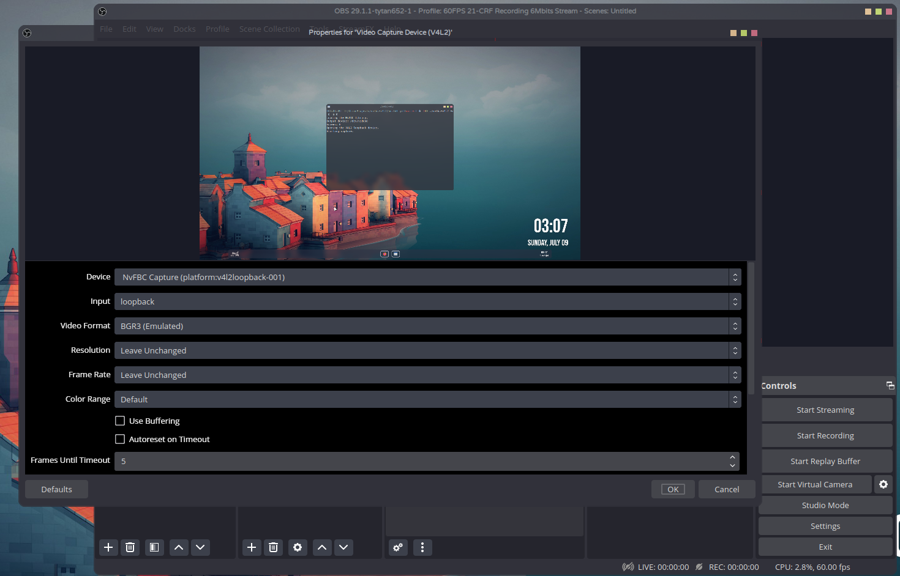

# nvfbc-v4l2

### Miss [obs-nvfbc](https://gitlab.com/fzwoch/obs-nvfbc)? Need a replacement? This project is for you!

This project is a tool (hack) for **Linux** that uses the [Nvidia NvFBC API](https://developer.nvidia.com/capture-sdk)
and passes the captured frames to a [v4l2loopback](https://github.com/umlaeute/v4l2loopback) device.

_**Because why not? It's better than nothing!**_

## Requirements:

* **An NVIDIA GPU that supports NvFBC.** _(if it wasn't obvious)_
* **A Linux Desktop with CMake and GCC installed.**
* **Nvidia drivers with NvFBC 1.9 / Capture SDK 9.0** _(recent proprietary or open kernel-module drivers)._
* **X11 _or_ Wayland.** Wayland capture goes through PipeWire and the XDG Desktop Portal.

Optional, only needed for the non-X11 backends. NvFBC `dlopen()`s these itself at
runtime, so you do **not** link them yourself:

* `libpipewire-0.3.so.0` (>= 1.0.0) and `libdbus-1.so.3` (>= 1.14.0) — the Wayland/PipeWire backend.
* `libdrm.so.2` (>= 2.4.110) — used by the PipeWire backend for DRM syncobjs.

----

## Installation:

In short: CMake

**_But how?_**

Like this:

```shell
$ git clone https://github.com/t1stm/nvfbc-v4l2.git
$ cd nvfbc-v4l2
$ mkdir build && cd build
$ cmake ..
$ make -j$(nproc)
```

----

## Running:

**If you have worked with v4l2loopback before:**

```shell
$ ./nvfbc-v4l2 -h
```

### If you haven't:

1. **Create a v4l2loopback device.**

**IMPORTANT: replace x and y with actual numbers and remember them**.

```shell
$ sudo modprobe v4l2loopback devices=1 video_nr=x card_label="NvFBC Capture" exclusive_caps=1
```

...or if you want to use the OBS Virtual Camera:

_If you don't have any other capture devices **set x to 0, and if you do, set it to the highest device number + 1**_

```shell
$ sudo modprobe v4l2loopback devices=2 video_nr=x,y card_label="OBS Virtual Camera, NvFBC Capture" exclusive_caps=1,1
```

2. **Optional:** List all available displays.

```shell
$ ./nvfbc-v4l2 -l
```

3. **Use the virtual v4l2loopback device and optionally the selected screen.**

```shell
$ ./nvfbc-v4l2 -o [v4l2-nr] -s [screen]
```

4. **Profit**



If the capture appears corrupted, try removing the v4l2loopback module and
adding it again with the commands above. If that doesn't help, open up an issue,
and I'll try my best to help. **Remember to close the program while doing this.**

----

## Backends

NvFBC 1.9 can capture through three backends, selected with `-b` / `--backend`:

| Backend    | Use case                                    | Notes |
|------------|---------------------------------------------|-------|
| `auto`     | Default. Picks one based on your session.   | Wayland → `pipewire`, else X11 → `x11`, else `direct`. |
| `x11`      | Classic X11 desktop capture.                | Per-output selection with `-s`, push model supported. |
| `pipewire` | Wayland capture via the XDG Desktop Portal. | The compositor shows a screen-picker dialog. |
| `direct`   | Capture a single Vulkan app by its pid.     | No display server required. |

### Wayland (PipeWire)

```shell
$ ./nvfbc-v4l2 -b pipewire -o 3
```

On the first run your compositor pops up a screen-picker / permission dialog
(tested on KWin 6 and Mutter 46). NvFBC then returns a *portal restore token*,
saved to `~/.cache/nvfbc-v4l2/portal.token` (override with `--portal-token <path>`).
Subsequent runs reuse that token and skip the dialog. Pass `--new-token` to ignore
the saved token and force a fresh session (and the picker dialog); the new session's
token then replaces the saved one.

`-s`/`--screen` does not apply here — the compositor's dialog picks the screen.

### Capturing a Vulkan application (direct)

The direct backend attaches to a single Vulkan application by pid over D-Bus,
without any display server. It first needs this D-Bus policy installed at
`/etc/dbus-1/system.d/nvidia-dbus.conf`:

```xml
<busconfig>
  <type>system</type>
  <policy context="default">
    <allow own_prefix="nvidia.nvfbc"/>
    <allow send_requested_reply="true" send_type="method_return"/>
    <allow send_requested_reply="true" send_type="error"/>
    <allow receive_requested_reply="true" receive_type="method_return"/>
    <allow receive_requested_reply="true" receive_type="error"/>
    <allow send_destination_prefix="nvidia.nvfbc"/>
  </policy>
</busconfig>
```

Then list the application's capture targets and capture one:

```shell
$ ./nvfbc-v4l2 -P <pid> -l            # list the capture targets owned by that pid
$ ./nvfbc-v4l2 -P <pid> -t 0 -o 3     # capture target 0 into /dev/video3
```

Per NvFBC, the direct backend is push-model only, cannot composite a cursor, and
cannot resize or capture a sub-region.

# Special Thanks To:

* [umläute](https://github.com/umlaeute) (umlaeute) - Developer of the v4l2loopback Linux module. | Without his work, this tool won't exist.
* [Florian Zwoch](https://gitlab.com/fzwoch) (fzwoch) - Developer of the obs-nvfbc plugin. | I read his plugin's code to understand the NvFBC API.
* The Nvidia Capture SDK devs | For making the API easy to use.

# Known Issues:
~~* V4L2 device doesn't show in Chromium-based applications, due to the BGRA444 color space being used.~~
